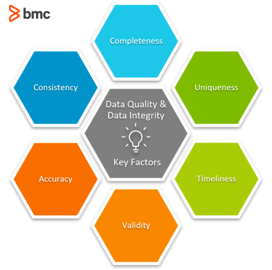

# Data Quality
# Timeliness
                     

- **Definition:** Timeliness is the degree to which data is up-to-date and available within an acceptable time frame, timeline, and duration.
The value of data-driven decisions not only depends on the correctness of the information but also on quick and timely answers. The time of occurrence of the associated real-world events is considered as a reference and the measure is assessed on a continuous basis. The value and accuracy of data may decay over time.
For instance, data about the number of traffic incidents from several years ago may not be completely relevant to make decisions on road infrastructure requirements for the immediate future.

- **Meaning by Chat GPT:** ความทันเวลา (Timeliness) หมายถึงระดับที่ข้อมูลเป็นปัจจุบันและพร้อมใช้งานภายในกรอบเวลา ระยะเวลา และไทม์ไลน์ที่ยอมรับได้
คุณค่าของการตัดสินใจที่ขับเคลื่อนด้วยข้อมูลไม่ได้ขึ้นอยู่กับความถูกต้องของข้อมูลเท่านั้น แต่ยังขึ้นอยู่กับการได้รับคำตอบที่รวดเร็วและทันเวลาอีกด้วย เวลาที่เหตุการณ์ในโลกจริงเกิดขึ้นถือเป็นข้อมูลอ้างอิง และการวัดค่าความทันเวลาจะถูกประเมินอย่างต่อเนื่อง คุณค่าและความถูกต้องของข้อมูลอาจลดลงเมื่อเวลาผ่านไป
ตัวอย่างเช่น ข้อมูลเกี่ยวกับจำนวนอุบัติเหตุจราจรเมื่อหลายปีก่อน อาจไม่เกี่ยวข้องเพียงพอสำหรับการตัดสินใจเกี่ยวกับความต้องการโครงสร้างพื้นฐานถนนในอนาคตอันใกล้

- **Meaning by Gemini:** ความตรงต่อเวลาคือระดับที่ข้อมูลเป็นปัจจุบันและพร้อมใช้งานภายในกรอบเวลา ช่วงเวลา และระยะเวลาที่ยอมรับได้
คุณค่าของการตัดสินใจที่ขับเคลื่อนด้วยข้อมูลไม่เพียงขึ้นอยู่กับความถูกต้องของข้อมูลเท่านั้น แต่ยังขึ้นอยู่กับคำตอบที่รวดเร็วและทันท่วงทีอีกด้วย เวลาที่เกิดเหตุการณ์จริงที่เกี่ยวข้องถือเป็นข้อมูลอ้างอิง และการวัดผลจะได้รับการประเมินอย่างต่อเนื่อง มูลค่าและความแม่นยำของข้อมูลอาจลดลงเมื่อเวลาผ่านไป
ตัวอย่างเช่น ข้อมูลเกี่ยวกับจำนวนอุบัติเหตุจราจรจากหลายปีก่อน อาจไม่เกี่ยวข้องกับการตัดสินใจเกี่ยวกับข้อกำหนดด้านโครงสร้างพื้นฐานถนนสำหรับอนาคตอันใกล้นี้อย่างสมบูรณ์

- **My Summary:** คือ ข้อมูลที่ทันสมัย เป็นปัจจุบัน และพร้อมใช้งานในเวลาที่เหมาะสม เพื่อสนับสนุนการตัดสินใจที่มีประสิทธิภาพ ข้อมูลที่ล้าสมัยหรือล่าช้าเกินไป อาจลดทอนความแม่นยำและการนำไปใช้ประโยชน์ อาจทำให้การตัดสินใจคลาดเคลื่อนจากความเป็นจริง
 
- **Sample:** 
  - **การพยากรณ์อากาศ**
    - ข้อมูลที่ไม่ Timely: ข้อมูลพยากรณ์อากาศเมื่อสัปดาห์ที่แล้ว บอกว่าวันนี้อากาศแจ่มใส
    - ข้อมูลที่ Timely: ข้อมูลพยากรณ์อากาศที่อัปเดตเมื่อเช้านี้ บอกว่าวันนี้จะมีฝนตกหนัก
    - ความสำคัญ: การใช้ข้อมูลพยากรณ์อากาศที่ Timely ช่วยให้เราเตรียมตัวรับมือกับสภาพอากาศได้อย่างเหมาะสม เช่น พกร่มหรือเสื้อกันฝน
  - **การวิเคราะห์ข้อมูลธุรกิจ**
    - ข้อมูลที่ไม่ Timely: รายงานยอดขายของเดือนที่แล้ว
    - ข้อมูลที่ Timely: แดชบอร์ดแสดงยอดขายแบบ Real-time
    - ความสำคัญ: การวิเคราะห์ข้อมูลที่ Timely ช่วยให้ธุรกิจปรับกลยุทธ์ได้อย่างรวดเร็ว เพื่อรับมือกับการเปลี่ยนแปลงของตลาด
- **[Source](https://www.bmc.com/blogs/data-integrity-vs-data-quality/)**
